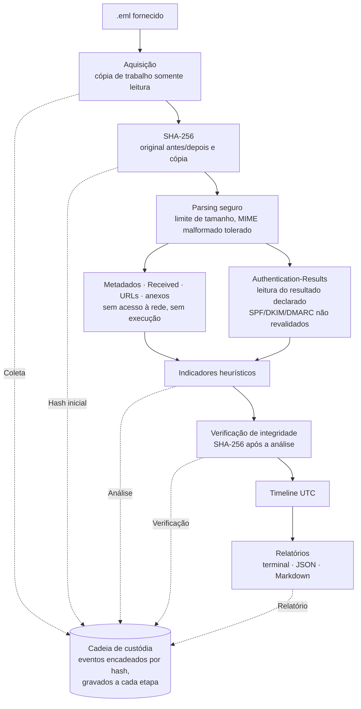

# Digital Evidence Lab

[](https://github.com/mavicmaciels/digital-evidence-lab/actions/workflows/tests.yml)
[](https://www.python.org/)
[](LICENSE)

**Triagem forense de e-mails suspeitos com preservação de evidência, cadeia de custódia e relatórios auditáveis.**

> [!IMPORTANT]
> **Aviso:** projeto com finalidade **educacional e de portfólio**. Não substitui
> perícia forense oficial, laudo pericial nem procedimentos institucionais de
> preservação de evidências. Os resultados apoiam a triagem e não constituem prova
> de fraude, de autenticidade ou de autoria.

## Visão geral

Um arquivo `.eml` é tratado como **evidência potencialmente hostil**. A ferramenta cria
uma cópia de trabalho somente leitura, calcula o SHA-256, extrai as informações
relevantes do e-mail (cabeçalhos, rota de entrega, links, anexos e os resultados
SPF/DKIM/DMARC *declarados*), organiza uma timeline em UTC, registra cada etapa em uma
cadeia de custódia com encadeamento de hashes, avalia indicadores heurísticos de
phishing e gera relatórios para terminal, JSON e Markdown.

**Nenhuma URL é acessada e nenhum anexo é executado ou gravado em disco.** Links são
tratados como texto e aparecem desarmados nos relatórios. Anexos são lidos apenas em
memória para o cálculo do hash. Tudo usa só a biblioteca padrão do Python.

| | |
|---|---|
| **Problema** | E-mails de phishing são o primeiro artefato de muitos incidentes e podem virar prova. Precisam ser analisados sem alterar o arquivo, sem disparar o conteúdo e com registro de cada manuseio. |
| **O que a ferramenta faz** | Aquisição com hash, extração de metadados, indicadores heurísticos, timeline, cadeia de custódia e relatórios. |
| **Competências demonstradas** | DFIR (aquisição, integridade, timeline, custódia), análise de phishing (cabeçalhos, `Received`, Authentication-Results, URLs, anexos), desenvolvimento seguro (entrada hostil, saída neutralizada, testes) e rigor sobre o que cada evidência permite afirmar. |
| **Como executar** | `python3 -m evidencelab analyze samples/email_suspeito.eml` (Python 3.10+, sem dependências) |
| **Limites** | Não revalida SPF/DKIM/DMARC, não consulta DNS nem reputação, não usa sandbox nem antivírus. O nível de suspeita é heurístico. Veja [Limitações](#limitações). |

## Demonstração

Saída real do arquivo fictício [`samples/email_suspeito.eml`](samples/email_suspeito.eml),
com `--authserv-id mx.vitima.example`. Linhas omitidas estão marcadas com `...`.

```text
$ python3 -m evidencelab analyze samples/email_suspeito.eml --examiner "Analista Demo" \
      --authserv-id mx.vitima.example

Evidência: email_suspeito.eml

[✓] Arquivo adquirido (cópia somente leitura)
[✓] SHA-256 calculado
[✓] Metadados extraídos
[✓] Integridade verificada (SHA-256 igual ao registrado)
[✓] Timeline construída (UTC)

SHA-256
723de153...6d31

INTEGRIDADE DA CÓPIA DE TRABALHO
● VERIFICADA (SHA-256 igual ao valor registrado na aquisição)

AUTENTICAÇÃO (resultado declarado no Authentication-Results selecionado: mx.vitima.example; não revalidado)
  SPF   falha (fail)
  DKIM  ausente (none)
  DMARC falha (fail)

NÍVEL DE SUSPEITA (heurístico): ALTO  [pontuação 19]
  [alta ] DMARC = fail (declarado no Authentication-Results selecionado, authserv-id mx.vitima.example); indício, não prova: ...
  [alta ] Domínio do remetente usado como subdomínio de outro domínio: banco-seguro[.]example[.]contas-verificacao[.]example
  [alta ] Link aponta para endereço IP: hxxp://203[.]0[.]113[.]45/banco/login.php?id=8812
  [média] Texto do link exibe www[.]banco-seguro[.]example, mas o destino é 203[.]0[.]113[.]45
  [alta ] Anexo executável com extensão dupla: Comprovante_Bloqueio.pdf.exe
  ...
```

Trecho da timeline no relatório Markdown (`relatorio_email_suspeito.md`):

| Horário (UTC) | Fonte | Evento |
|---|---|---|
| 2026-10-05T13:13:57Z | e-mail | Cabeçalho Date (informado pelo remetente; não confiável) |
| 2026-10-05T13:14:05Z | e-mail | Received 2: smtp-out.promo-entregas.example [203.0.113.45] → mx.vitima.example |
| 2026-10-05T13:14:09Z | e-mail | Received 3: mx.vitima.example [198.51.100.10] → mail.vitima.example |
| 2026-10-06T14:36:26Z | custódia | Coleta |
| 2026-10-06T14:36:26Z | custódia | Hash inicial |
| 2026-10-06T14:36:26Z | custódia | Relatório |

Sem `--authserv-id`, o mesmo cabeçalho aparece apenas como declarado
(`[1] mx.vitima.example: spf=fail dkim=none dmarc=fail (declarado)`), não pontua e o
resultado ainda é ALTO (pontuação 14), por causa dos demais indicadores.

## Como executar

Requer **Python 3.10+**. Não há dependências externas.

```bash
# Adquirir e analisar (cria casos/email_suspeito/)
python3 -m evidencelab analyze samples/email_suspeito.eml --examiner "Nome do analista"

# Selecionar o Authentication-Results de um serviço que você tem motivo para confiar
python3 -m evidencelab analyze mensagem.eml --authserv-id mx.suaempresa.com.br

# Reverificar depois a integridade da cópia e do registro de custódia
python3 -m evidencelab verify casos/email_suspeito
```

Códigos de saída: `0` sucesso; `1` falha de integridade, de encadeamento da custódia ou
erro de análise; `2` arquivo ou caso não encontrado.

## Arquitetura



- **`case.py`** orquestra o fluxo: aquisição, análise e verificação. É o único ponto que
  copia a evidência.
- **`email_analysis.py`** apenas lê o `.eml` e devolve estruturas de dados. Não grava
  arquivos nem acessa a rede.
- **`custody.py`** grava o registro de custódia (atomicamente, a cada evento) com
  encadeamento de hashes.
- **`report.py`** grava os relatórios. Todo texto vindo do e-mail passa antes por
  **`sanitize.py`** (escape de controle/ANSI/bidi, Markdown seguro, defang de URLs).

## Funcionalidades

| Etapa | O que faz |
|---|---|
| **Aquisição** | Copia o `.eml` para `casos/<nome>/evidencia/` com criação exclusiva (nunca sobrescreve), preserva os timestamps do arquivo e marca a cópia como somente leitura. O original é apenas lido. |
| **SHA-256** | Calcula o hash do original **antes e depois** da cópia e o da cópia de trabalho. Os três têm de coincidir. |
| **Metadados** | Cabeçalhos principais (com decodificação RFC 2047), saltos `Received` em ordem cronológica (IP, hosts, protocolo, data original e em UTC), links (texto e HTML) e anexos, inclusive dentro de mensagens encaminhadas, com SHA-256 de cada um. |
| **Authentication-Results** | Lista todos os cabeçalhos com seus resultados declarados. Só o cabeçalho do `--authserv-id` escolhido pelo analista é selecionado e pontuado, com estados **pass declarado / falha / falha fraca / inconclusivo / ausente**. Sem seleção, os mecanismos ficam "não avaliado". Detalhes [abaixo](#authentication-results-e-confiança). |
| **Indicadores** | Heurísticas com severidade (alta/média/baixa/info), como DMARC `fail` declarado no cabeçalho selecionado, links para IP, texto do link que mostra um domínio e leva a outro, domínio do remetente usado como subdomínio de outro domínio, punycode, esquemas `javascript:`/`data:`, anexos executáveis, imagens de disco, Office com macros, extensão dupla, caracteres bidirecionais em nomes de arquivo e linguagem de urgência. |
| **Integridade** | Recalcula o hash após a análise. O comando `verify` repete a verificação depois e registra o resultado. |
| **Timeline** | Une eventos do e-mail e da custódia em uma linha do tempo única, em UTC. |
| **Cadeia de custódia** | Registro append-only em JSON, persistido a cada evento, com **encadeamento de hashes** (`prev_hash` → `event_hash`) que revela edições posteriores no registro. |
| **Relatórios** | Painel no terminal, `relatorio_<nome>.json` (para ferramentas) e `relatorio_<nome>.md` (para pessoas, com URLs desarmadas). |

## Authentication-Results e confiança

O cabeçalho `Authentication-Results` registra os resultados de SPF, DKIM e DMARC
declarados por algum serviço de autenticação, identificado pelo `authserv-id`. O RFC 8601
alerta que esse cabeçalho **pode ser forjado** por qualquer participante do envio,
inclusive o remetente. Por isso o consumidor precisa saber, por meios próprios, quais
serviços de autenticação são confiáveis. A posição do cabeçalho na mensagem não prova
quem o inseriu.

Por isso a ferramenta:

- **por padrão, não seleciona nenhum cabeçalho.** Todos são listados como declarados,
  com seu `authserv-id`, mas não pontuam e os mecanismos aparecem como "não avaliado";
- com `--authserv-id <id>`, seleciona o cabeçalho mais alto com esse `authserv-id` e
  pontua apenas os resultados declarados nele. Cabeçalhos de outros `authserv-id` são
  ignorados e relatados. Cabeçalhos repetidos com o mesmo `authserv-id` também são
  relatados, porque o servidor de borda deveria tê-los removido;
- **não determina sozinha** se um `Authentication-Results` veio de infraestrutura
  confiável. O valor passado em `--authserv-id` deve ser o de um serviço que o analista
  tem fundamento externo para considerar confiável, como o servidor de borda da própria
  organização, cuja configuração ele conhece;
- **não revalida** SPF, DKIM ou DMARC. Mesmo com o `authserv-id` correspondente, o
  relatório mostra o "resultado declarado no Authentication-Results selecionado";
- **não trata `pass` como sinal de legitimidade.** Um resultado `pass` não reduz a
  pontuação, e um e-mail com `dmarc=pass` declarado pode continuar com suspeita ALTA.

## Estrutura de diretórios

```
digital-evidence-lab/
├── evidencelab/
│   ├── __main__.py        # python -m evidencelab
│   ├── cli.py             # subcomandos analyze / verify
│   ├── case.py            # aquisição, verificação e orquestração do caso
│   ├── custody.py         # cadeia de custódia com encadeamento de hashes
│   ├── email_analysis.py  # parsing do .eml, Authentication-Results, links, anexos, indicadores
│   ├── hashing.py         # SHA-256 em blocos
│   ├── report.py          # painel, JSON e Markdown
│   ├── sanitize.py        # escape de controle/bidi, Markdown seguro, defang
│   └── timeline.py        # linha do tempo unificada em UTC
├── samples/
│   └── email_suspeito.eml # phishing fictício (domínios .example, IPs RFC 5737)
├── tests/
│   └── test_evidencelab.py
├── .github/workflows/
│   └── tests.yml          # CI: unittest em Python 3.10–3.13
├── LICENSE                # MIT
└── README.md

casos/<nome>/              # gerado em tempo de execução (ignorado pelo git)
├── evidencia/<arquivo>.eml   # cópia de trabalho, somente leitura
├── cadeia_custodia.json
├── relatorio_<nome>.json
└── relatorio_<nome>.md
```

## Testes

```bash
python3 -m unittest -v
```

São 43 testes, executados pelo GitHub Actions em Python 3.10, 3.11, 3.12 e 3.13 e
organizados em grupos:

- **Hash:** valor conhecido do SHA-256 (vetor `abc`) e abreviação.
- **Preservação:** o original mantém hash, `mtime` e permissões após o fluxo completo; a
  cópia fica sem permissão de escrita e com o mesmo `mtime`; aquisição repetida e uma
  segunda evidência no mesmo caso são recusadas.
- **Custódia:** ordem dos eventos, timestamps em UTC, adulteração da evidência e do JSON
  de custódia detectadas pelo `verify`, nome de evidência com componentes de caminho
  (`../`) recusado.
- **Authentication-Results:** ausência, `none`, inconclusivo (`temperror`, `neutral`,
  `permerror`), falhas pontuadas só quando selecionadas, comentários e chaves parecidas
  (`x-dkim=`) ignorados, padrão sem seleção, cabeçalho forjado com outro `authserv-id`
  (no topo ou abaixo), cabeçalho repetido com o mesmo `authserv-id`, `authserv-id`
  inesperado, seleção explícita, `pass` que não torna o e-mail legítimo e várias
  assinaturas DKIM.
- **Falsos positivos:** e-mail corporativo legítimo (com "senha" e Reply-To de helpdesk)
  classificado como BAIXO; subdomínios da mesma organização; sufixos como `.com.br`.
- **Robustez:** datas sem fuso, URL malformada, IPv6 em `Received`, anexo dentro de
  `message/rfc822`, nome de arquivo com caractere bidirecional, link `javascript:`.
- **Segurança:** nenhuma conexão de rede nem criação de processo durante o fluxo
  (`socket`, `subprocess` e `os.system` bloqueados no teste); nenhum anexo gravado no
  disco; sequências ANSI e HTML neutralizados no terminal e no Markdown.

## Aspectos de segurança

- **Nada é executado nem acessado.** Anexos são decodificados apenas em memória para o
  cálculo do hash e nunca são gravados nem abertos. URLs são tratadas como texto e
  nenhuma requisição de rede é feita. O pacote não importa `socket`, `subprocess`,
  `urllib.request` ou equivalentes, e um teste bloqueia rede e criação de processos
  durante o fluxo completo.
- **Entrada hostil.** Limite de tamanho (50 MiB), parsing com `email.policy.default`,
  tolerância a cabeçalhos e MIME malformados (os defeitos são registrados no relatório)
  e extração de links com `html.parser`, sem renderizar HTML.
- **Saída neutralizada.** Caracteres de controle, sequências ANSI e controles
  bidirecionais (ex.: U+202E) são escapados. No Markdown, HTML e sintaxe de link/tabela
  são escapados e as URLs aparecem desarmadas (`hxxp://dominio[.]com`).
- **Não sobrescrita e caminhos.** A cópia é criada em modo exclusivo, e um caso já
  iniciado nunca tem cópia ou registro de custódia sobrescritos. O nome de evidência
  lido do JSON de custódia é reduzido ao componente final, e `.`/`..` são recusados.
- **Authentication-Results forjáveis.** Nada é pontuado sem que o analista selecione
  explicitamente um `authserv-id` (veja a [seção acima](#authentication-results-e-confiança)).

## Terminologia: o que a ferramenta afirma e o que não afirma

| Conceito | Neste projeto |
|---|---|
| **Integridade** | O SHA-256 é usado para verificar se os bytes da cópia de trabalho permanecem inalterados em relação ao valor registrado na aquisição. A correspondência **auxilia** a verificação de integridade, e seu valor depende da confiabilidade desse valor de referência e do procedimento de aquisição. A ferramenta não tem como saber se o arquivo foi alterado antes de chegar a ela. |
| **Autenticidade** | **Não demonstrada.** Hash igual não demonstra, isoladamente, que o conteúdo é genuíno nem verdadeiro, só que os bytes não mudaram desde o registro. SPF/DKIM/DMARC aparecem como resultados *declarados* no Authentication-Results selecionado e não são revalidados (DKIM poderia ser revalidado com a chave pública do domínio, fora do escopo). |
| **Autoria** | **Não atribuída.** Hash e metadados não demonstram autoria. `From`, `Date` e os `Received` mais antigos são definidos ou forjáveis pelo remetente. Atribuir autoria exige outras fontes, como logs do provedor, dados cadastrais e ordem judicial. |
| **Cadeia de custódia** | Registro documental das ações sobre a evidência (quem, quando, o quê, com qual hash). O encadeamento de hashes evidencia edições no registro, mas **não é assinatura digital nem carimbo de tempo**: quem controla o arquivo pode recalcular a cadeia. |
| **Nível de suspeita** | Priorização heurística para triagem. Não é laudo nem conclusão. |

## Relação entre DFIR, análise de phishing e prova digital

O phishing é um dos principais vetores iniciais de incidentes. Em **DFIR**, o e-mail
suspeito costuma ser o primeiro artefato: dele saem indicadores (IPs, domínios, hashes de
anexos) para bloquear, procurar em outras caixas e correlacionar com logs de proxy, EDR e
autenticação. A **análise de phishing** responde se a mensagem é maliciosa, o que ela
tenta fazer e quem mais a recebeu.

Quando o incidente pode virar processo administrativo, trabalhista ou judicial, o mesmo
arquivo vira **prova digital**. Aí a forma como foi tratado importa tanto quanto o que se
concluiu: aquisição sem alteração, hash registrado na coleta, cópia de trabalho separada
do original, documentação de cada manuseio e conclusões limitadas ao que os dados
sustentam. Este projeto exercita esses cuidados em escala de laboratório. Ele trabalha
sobre uma cópia, registra cada ação, separa fatos verificáveis de heurísticas e declara
os limites de cada conclusão.

## Limitações

- **Estado de entrada.** O `.eml` é analisado no estado em que foi fornecido. O
  programa não verifica como o arquivo foi originalmente exportado do cliente ou
  servidor de e-mail, nem se foi alterado antes da aquisição. Essa etapa é crítica em
  uma coleta real.
- **Sem DNS.** Não há consultas DNS de nenhum tipo.
- **SPF/DKIM/DMARC não revalidados.** A ferramenta só lê o resultado declarado no
  `Authentication-Results`, sem verificar registros SPF, assinaturas DKIM nem políticas
  DMARC.
- **Confiança externa.** O valor de um `Authentication-Results` depende de confiança
  externa na infraestrutura que o produziu. A ferramenta não consegue estabelecer essa
  confiança: ela vem do conhecimento do analista ao escolher `--authserv-id`.
- **Sem reputação, sandbox ou antivírus.** Não há consulta de reputação de IP ou
  domínio, execução em sandbox nem verificação de anexos por antivírus.
- **Heurísticas.** Indicadores e pesos são deliberadamente simples e podem gerar falsos
  positivos e falsos negativos. O domínio registrável é aproximado com uma lista reduzida
  de sufixos de dois níveis, não com a Public Suffix List completa.
- **`Received`.** Os cabeçalhos são interpretados por expressão regular. Formatos
  incomuns podem gerar campos vazios, e os saltos anteriores à infraestrutura do
  destinatário podem ser forjados.
- **Custódia.** O encadeamento de hashes do registro não é assinatura digital e não
  substitui carimbo de tempo (RFC 3161) nem armazenamento WORM.
- **Somente leitura.** A permissão somente leitura na cópia protege contra acidentes,
  não contra um usuário privilegiado.

## Referências técnicas e normativas

Referências conceituais relacionadas ao projeto. O projeto **não** é certificado, não
declara conformidade com essas normas, não as implementa integralmente, não satisfaz por
si requisitos legais de cadeia de custódia e não produz prova judicialmente válida.

- **RFC 8601** — *Message Header Field for Indicating Message Authentication Status*
  (IETF, 2019). Base da interpretação do `Authentication-Results`, do `authserv-id` e
  das considerações sobre cabeçalhos forjados.
- **ABNT NBR ISO/IEC 27037:2013** — *Tecnologia da informação — Técnicas de segurança —
  Diretrizes para identificação, coleta, aquisição e preservação de evidência digital*.
  Referência conceitual para aquisição e preservação.
- **Código de Processo Penal brasileiro (Decreto-Lei nº 3.689/1941), arts. 158-A a
  158-F**, incluídos pela Lei nº 13.964/2019. Disciplinam a cadeia de custódia e servem
  de referência conceitual para o registro de custódia.

## Licença e dados

Código distribuído sob a **licença MIT**. Veja o arquivo [`LICENSE`](LICENSE).

O arquivo `samples/email_suspeito.eml` é **inteiramente fictício**. Usa domínios
reservados `.example`, IPs de documentação (RFC 5737) e um "executável" de poucos bytes
sem código funcional. Não contém dados pessoais nem marcas reais.
